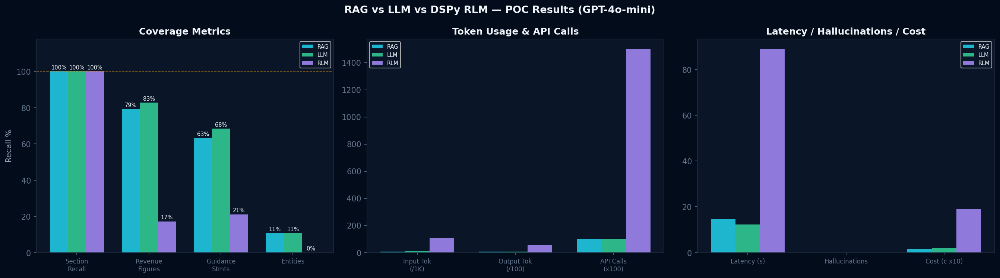
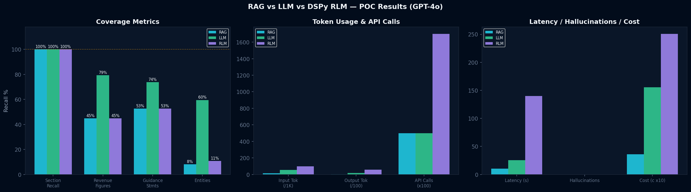

# RLM vs RAG vs LLM POC — MSFT Earnings Call Analysis

Proof of Concept comparing **DSPy Reasoning Language Model (RLM)** against **traditional Retrieval-Augmented Generation (RAG)** and **full-context LLM** for structured extraction from long-form financial documents.

## Hypothesis

> DSPy RLM achieves higher section recall and lower hallucination counts than vanilla RAG on long earnings call transcripts, at the cost of higher latency and token spend — making it better suited for **batch (non-real-time) pipelines**. A full-context LLM baseline tests whether retrieval is even necessary when the document fits in the context window.

## Architecture

| Component | RAG Pipeline | LLM Pipeline | RLM Pipeline |
|---|---|---|---|
| **Embedding** | IBM Granite `granite-embedding-125m-english` (local) | N/A | N/A |
| **Vector DB** | FAISS (in-memory, `IndexFlatIP`) | N/A | N/A |
| **Framework** | OpenAI SDK + FAISS | OpenAI SDK | DSPy `dspy.RLM` |
| **Response** | Single JSON (5 sections) | Single JSON (5 sections) | Single JSON (5 sections) |
| **Document** | MSFT Q2 FY2026 Earnings Call (~11K tokens) | Same | Same |

All pipelines produce the same 5-section JSON output schema: `executive_summary`, `revenue_by_segment`, `forward_guidance`, `risk_factors`, `analyst_qa_themes`.

## Project Structure

```
RLMRAG/
├── Data/                              # Source documents
│   ├── TranscriptQandAFY26q2.docx     # Original Q&A transcript
│   └── msft_ec.txt                    # Earnings call data
├── Experiment/
│   ├── v1/                            # Claude Sonnet POC (2-way)
│   │   └── rlm_vs_rag_poc.ipynb
│   ├── v2/                            # GPT-4o POC (2-way RAG vs RLM)
│   │   ├── rlm_vs_rag_poc_gpt4.ipynb
│   │   ├── executed_rlm_vs_rag_poc_gpt4.ipynb
│   │   ├── requirements.txt
│   │   ├── .env.example
│   │   ├── poc_results.json
│   │   ├── ground_truth.json          # 45 items
│   │   ├── rag_vs_rlm_results.png
│   │   └── msft_q2_fy2026_transcript.txt
│   └── v3/                            # 3-way comparison (latest)
│       ├── data/                      # Shared data for v3 sub-experiments
│       │   ├── ground_truth.json      # 102 items (expanded)
│       │   └── msft_ec.txt            # Real transcript (~52KB)
│       ├── v3.1/                      # GPT-4o, 5 calls per pipeline
│       │   ├── rlm_vs_rag_vs_llm_poc.ipynb
│       │   ├── poc_results.json
│       │   ├── rag_vs_llm_vs_rlm_results.png
│       │   └── requirements.txt
│       └── v3.2/                      # GPT-4o-mini, single JSON call
│           ├── rlm_vs_rag_vs_llm_poc.ipynb
│           ├── executed.ipynb
│           ├── poc_results.json
│           └── rag_vs_llm_vs_rlm_results.png
├── Knowledge/                         # Research & presentations
│   ├── rag-vs-rlm-comparison.pptx
│   ├── context-rot-analysis.jsx
│   ├── context-rot.pptx
│   └── poc_rlm_vs_rag.docx
└── README.md
```

## Setup & Execution

### Prerequisites
- Python 3.10+
- OpenAI API key with GPT-4o-mini access
- Deno runtime (required for DSPy RLM sandbox)

### Installation
```bash
cd Experiment/v2
python -m venv venv
# Linux/Mac: source venv/bin/activate
# Windows:   venv\Scripts\activate
pip install -r requirements.txt
```

### Configuration
```bash
cp .env.example .env
# Edit .env and add your OpenAI API key
```

### Run V3.2 (Latest — GPT-4o-mini, Single JSON Call)
```bash
cd Experiment/v3/v3.2

jupyter nbconvert --to notebook --execute \
  --ExecutePreprocessor.timeout=600 \
  --output executed.ipynb \
  rlm_vs_rag_vs_llm_poc.ipynb
```

### Run V3.1 (GPT-4o, 5 Calls Per Pipeline)
```bash
cd Experiment/v3/v3.1

jupyter nbconvert --to notebook --execute \
  --ExecutePreprocessor.timeout=600 \
  --output executed.ipynb \
  rlm_vs_rag_vs_llm_poc.ipynb
```

Or open any notebook in Jupyter and run all cells interactively.

## Experiments

### v3.2 — GPT-4o-mini, Single JSON Call (Latest)

**3-way comparison: RAG vs LLM vs RLM** using `gpt-4o-mini` for all pipelines. Each pipeline returns a **single JSON object** with all 5 sections via one LLM call.

**Key design:**
- **RAG**: Retrieves chunks for all 5 queries, deduplicates, makes one combined LLM call with `response_format={"type": "json_object"}`. Includes regex pattern analysis table (16 patterns across 5 categories).
- **LLM**: Full-context baseline — passes the entire transcript in a single call. Tests whether retrieval adds value when the document fits in the context window.
- **RLM**: DSPy `dspy.RLM` with GPT-4o-mini for both root and sub calls (max 25 iterations, 50 LLM calls). Includes custom tools (`search_context`, `extract_numbers`) and regex pattern capture table from generated REPL code.

**Results (v3.2):**

| Metric | RAG (Granite+FAISS+GPT-4o-mini) | LLM (GPT-4o-mini) | RLM (DSPy+GPT-4o-mini) | Winner |
|:---|:---|:---|:---|:---|
| **Section Recall (/5)** | 5/5 | 5/5 | 5/5 | Tie |
| **Revenue Figure Recall** | 79.3% | 82.8% | 17.2% | LLM |
| **Guidance Recall** | 63.2% | 68.4% | 21.1% | LLM |
| **Entity Recall** | 10.8% | 10.8% | 0.0% | Tie (RAG/LLM) |
| **Hallucinations** | 0 | 0 | 0 | Tie |
| **Wall Clock Time** | 14.5s | 12.3s | 88.9s | LLM |
| **Estimated Cost** | $0.00148 | $0.00206 | $0.01913 | RAG |

**v3.2 Verdict:** LLM wins on composite accuracy (best recall across revenue and guidance). RAG is cheapest. RLM is 6x slower and 13x more expensive than RAG with significantly lower recall. Full context beats retrieval when the document fits in the context window.

### v3.1 — GPT-4o, 5 Calls Per Pipeline

**3-way comparison: RAG vs LLM vs RLM** using `gpt-4o` for generation (RLM uses `gpt-4o` root + `gpt-4o-mini` sub). Each pipeline makes 5 separate LLM calls (one per section).

**Results (v3.1):**

| Metric | RAG (Granite+FAISS+GPT-4o) | LLM (GPT-4o) | RLM (DSPy+GPT-4o) | Winner |
|:---|:---|:---|:---|:---|
| **Section Recall (/5)** | 5/5 | 5/5 | 5/5 | Tie |
| **Revenue Figure Recall** | 44.8% | 79.3% | 44.8% | LLM |
| **Guidance Recall** | 52.6% | 73.7% | 52.6% | LLM |
| **Entity Recall** | 8.1% | 59.5% | 10.8% | LLM |
| **Hallucinations** | 0 | 0 | 0 | Tie |
| **Wall Clock Time** | 10.3s | 25.4s | 139.9s | RAG |
| **Estimated Cost** | $0.036 | $0.155 | $0.251 | RAG |

**v3.1 Verdict:** LLM dominates on accuracy (composite 12.59 vs RAG 11.50 vs RLM 11.52). RAG is fastest and cheapest but misses sections without retrieved context (executive summary, guidance, risks, Q&A all returned "Not found in retrieved chunks"). RLM matches RAG recall at 14x latency and 7x cost.

### v2 — GPT-4o 2-Way Comparison

2-way RAG vs RLM using `gpt-4o` for generation and `gpt-4o-mini` for RLM sub-calls. Each pipeline makes 5 separate LLM calls (one per section). Ground truth: 45 items.

**Results (v2):**

| Metric | RAG (Granite+FAISS+GPT-4o) | RLM (DSPy+GPT-4o) | Winner |
|:---|:---|:---|:---|
| **Section Recall (/5)** | 5/5 | 5/5 | Tie |
| **Revenue Figure Recall** | 23.1% | 7.7% | RAG |
| **Guidance Recall** | 25.0% | 0.0% | RAG |
| **Entity Recall** | 26.7% | 26.7% | Tie |
| **Hallucinations** | 0 | 0 | Tie |
| **Wall Clock Time** | 9.0s | 586.5s | RAG (65x faster) |
| **Estimated Cost** | $0.035 | $1.152 | RAG (33x cheaper) |

**v2 Verdict:** Hypothesis NOT confirmed. RAG outperformed RLM while being 65x faster and 33x cheaper. RLM's Deno sandbox had environment issues on Windows.

### v1 — Claude-based POC

Initial experiment using Claude Sonnet as the LLM backbone. See `Experiment/v1/`.

## Key Findings Across All Experiments

1. **LLM (full context) consistently wins on accuracy** when the document fits in the context window. Having complete context eliminates the information loss from chunking/retrieval.
2. **RAG is fastest and cheapest** but suffers from retrieval gaps — sections not covered by retrieved chunks return empty results (especially executive summary and forward guidance).
3. **RLM underperforms expectations** — the Deno sandbox overhead, limited REPL iterations, and code-generation approach produce lower recall at much higher cost and latency.
4. **GPT-4o-mini is dramatically cheaper** than GPT-4o ($0.002 vs $0.155 for LLM) with comparable accuracy, making it the clear choice for this task.
5. **Zero hallucinations** across all pipelines and all experiments — all three approaches are factually grounded when properly prompted.

## Ground Truth

| Version | Revenue | Guidance | Risk | Analyst | Entities | Total |
|---|---|---|---|---|---|---|
| **v2** | 13 | 8 | 5 | 4 | 15 | **45** |
| **v3** | 29 | 19 | 9 | 8 | 37 | **102** |

## Pipeline Recommendations

| Use Case | Recommended Pipeline | Rationale |
|---|---|---|
| Real-time user Q&A | **RAG** | Lowest latency, cost-efficient |
| Single-doc analysis | **LLM** | Full context when doc fits in window |
| Multi-doc batch | **RLM** | Completeness-critical, complex reasoning |

## Visualization

The executed notebooks contain styled comparison tables, 3-panel matplotlib charts, and 3-way HTML output diffs.

**V3.2 (GPT-4o-mini, 3-way):**



**V3.1 (GPT-4o, 3-way):**



**V2 (GPT-4o, 2-way):**


## Key Dependencies

`openai`, `dspy-ai`, `faiss-cpu`, `sentence-transformers` (IBM Granite), `torch`, `beautifulsoup4`, `tiktoken`, `matplotlib`, `pandas`, `rich`

## License

MIT
