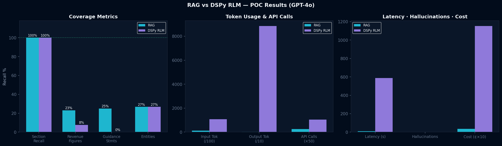

# RLM vs RAG POC — MSFT Earnings Call Analysis

Proof of Concept comparing **DSPy Reasoning Language Model (RLM)** against **traditional Retrieval-Augmented Generation (RAG)** for structured extraction from long-form financial documents.

## Hypothesis

> DSPy RLM achieves higher section recall and lower hallucination counts than vanilla RAG on long earnings call transcripts, at the cost of higher latency and token spend — making it better suited for **batch (non-real-time) pipelines**.

## Architecture

| Component | RAG Pipeline | RLM Pipeline |
|---|---|---|
| **LLM** | GPT-4o | GPT-4o (root) + GPT-4o-mini (sub-calls) |
| **Embedding** | IBM Granite `granite-embedding-125m-english` (local) | N/A (no pre-indexing) |
| **Vector DB** | FAISS (in-memory) | N/A |
| **Framework** | OpenAI SDK + FAISS | DSPy `dspy.RLM` |
| **Document** | MSFT Q2 FY2026 Earnings Call (~10K tokens) | Same |

## Project Structure

```
RLMRAG/
├── Data/                          # Source documents
│   ├── TranscriptQandAFY26q2.docx # Original Q&A transcript
│   └── msft_ec.txt                # Earnings call data
├── Experiment/
│   ├── v1/                        # Initial Claude-based POC
│   │   └── rlm_vs_rag_poc.ipynb
│   └── v2/                        # GPT-4o POC (primary)
│       ├── rlm_vs_rag_poc_gpt4.ipynb          # Source notebook
│       ├── executed_rlm_vs_rag_poc_gpt4.ipynb  # Executed with outputs
│       ├── requirements.txt
│       ├── .env.example
│       ├── poc_results.json                    # Structured metrics
│       ├── ground_truth.json                   # Evaluation ground truth
│       ├── rag_vs_rlm_results.png              # Comparison charts
│       └── msft_q2_fy2026_transcript.txt       # Cached transcript
├── Knowledge/                     # Research & presentations
│   ├── rag-vs-rlm-comparison.pptx
│   ├── context-rot-analysis.jsx
│   ├── context-rot.pptx
│   └── poc_rlm_vs_rag.docx
└── README.md
```

## Setup & Execution

### Prerequisites
- Python 3.10+
- OpenAI API key with GPT-4o access

### Installation
```bash
git clone https://github.com/praveenjoshi01/rlm-vs-rag-poc.git
cd rlm-vs-rag-poc/Experiment/v2

python -m venv venv
# Linux/Mac: source venv/bin/activate
# Windows:   venv\Scripts\activate
pip install -r requirements.txt
```

### Configuration
```bash
cp .env.example .env
# Edit .env and add your OpenAI API key
```

### Run
```bash
jupyter nbconvert --to notebook --execute \
  --ExecutePreprocessor.timeout=600 \
  --output executed_rlm_vs_rag_poc_gpt4.ipynb \
  rlm_vs_rag_poc_gpt4.ipynb
```

Or open `rlm_vs_rag_poc_gpt4.ipynb` in Jupyter and run all cells interactively.

## Results (Latest Run — Real Transcript)

Using the **real Microsoft Q2 FY2026 earnings call transcript** (~10,819 tokens / 28 pages) fetched from the investor relations page.

### Quantitative Summary

| Metric | RAG (Granite+FAISS+GPT-4o) | RLM (DSPy+GPT-4o) | Winner |
|:---|:---|:---|:---|
| **Section Recall (/5)** | 5/5 | 5/5 | Tie |
| **Revenue Figure Recall** | 23.1% | 7.7% | RAG |
| **Guidance Recall** | 25.0% | 0.0% | RAG |
| **Entity Recall** | 26.7% | 26.7% | Tie |
| **Hallucinations** | 0 | 0 | Tie |
| **Wall Clock Time** | 9.0s | 586.5s | RAG (65x faster) |
| **Estimated Cost** | $0.035 | $1.152 | RAG (33x cheaper) |
| **API Calls** | 5 | 21 | RAG |
| **Input Tokens** | 12,942 | 106,760 | RAG |
| **Output Tokens** | 299 | 88,549 | RAG |

### Composite Score
- **RAG: 10.86** vs **RLM: 10.25**

### Verdict

**Hypothesis NOT confirmed** on this run. RAG outperformed RLM on factual extraction accuracy while being 65x faster and 33x cheaper.

**Key observations:**
- RAG with 24 FAISS chunks (k=5 retrieval) effectively surfaced revenue-by-segment data
- RLM's REPL sandbox (Deno) had environment issues on Windows, causing the agent to produce generic/placeholder answers instead of extracting actual transcript data
- RLM used 15 REPL iterations with regex, loop/map, and slice strategies but couldn't reliably execute code
- Both systems achieved 5/5 section recall (all sections populated), but RAG had substantially better factual content

**When to use which:**
- **RAG** — Real-time Q&A, latency-critical applications, cost-sensitive deployments
- **RLM** — Batch summarization where completeness matters more than speed, multi-document analysis, complex extraction requiring iterative reasoning (once sandbox issues are resolved)

### Visualization

The executed notebook contains styled comparison tables and charts. See `rag_vs_rlm_results.png`:



## Ground Truth

The evaluation uses a manually constructed ground truth (`ground_truth.json`) with:
- 13 revenue figures (exact $ and %)
- 8 guidance statements (Q3 ranges)
- 5 risk factors
- 4 analyst Q&A topics
- 15 named entities

## Experiments

### v1 — Claude-based POC
Initial experiment using Claude as the LLM backbone. See `Experiment/v1/`.

### v2 — GPT-4o POC (Primary)
Production experiment using OpenAI GPT-4o for both RAG generation and RLM orchestration, with GPT-4o-mini for cheaper REPL sub-calls. See `Experiment/v2/`.

## License

MIT
